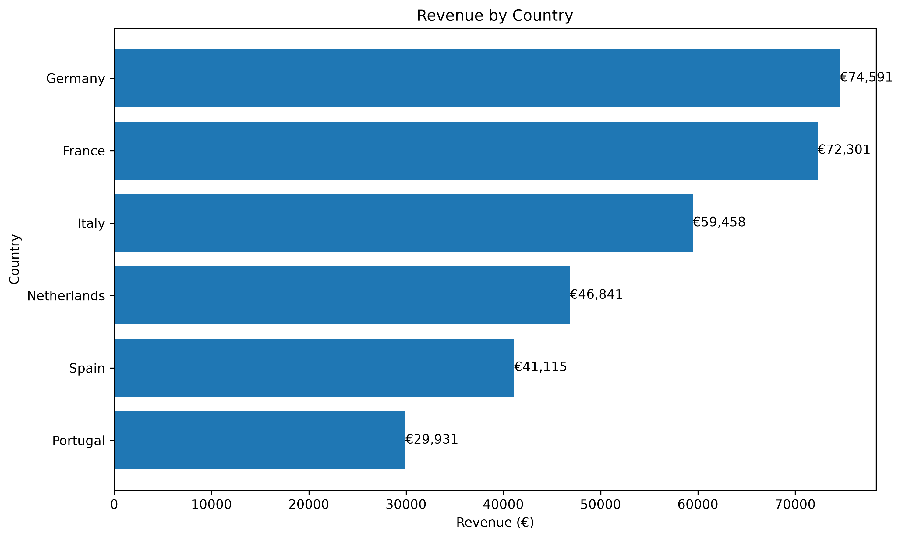
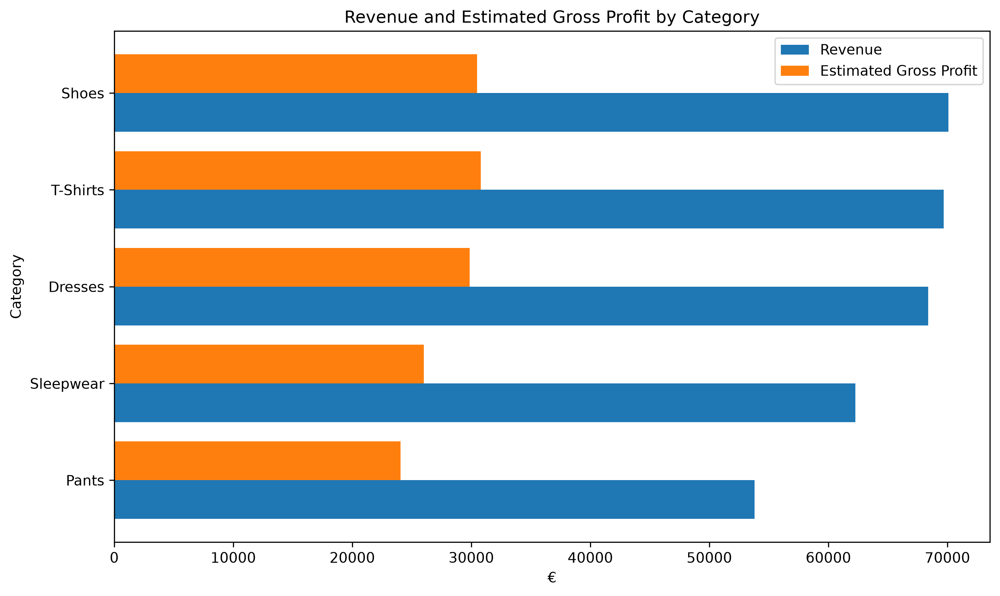
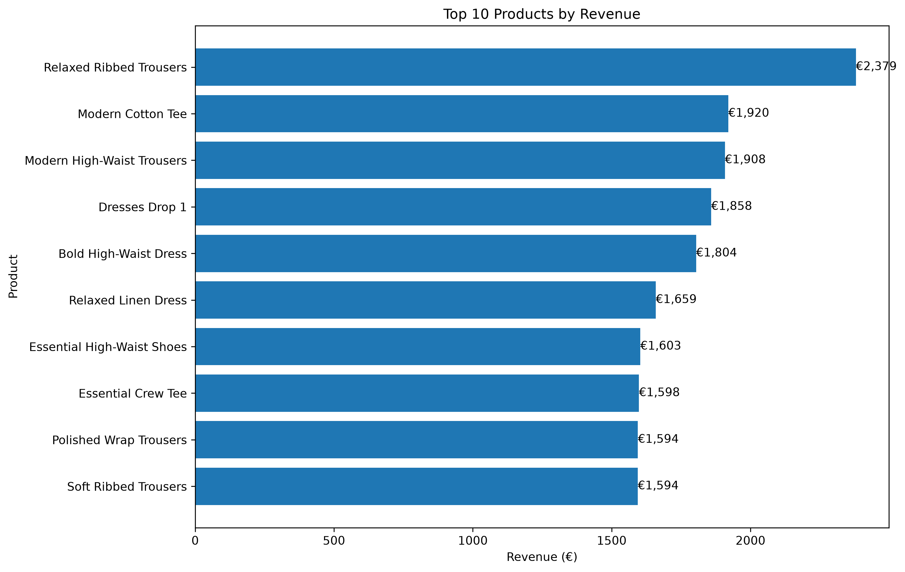
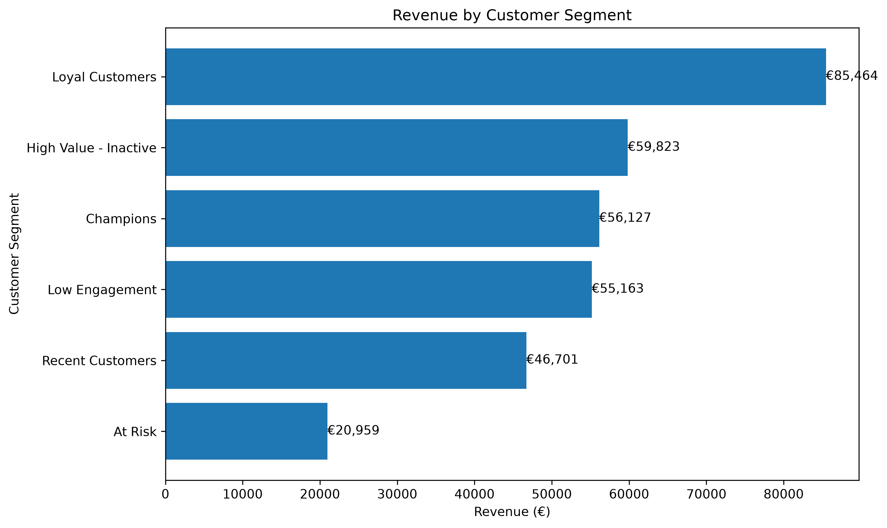
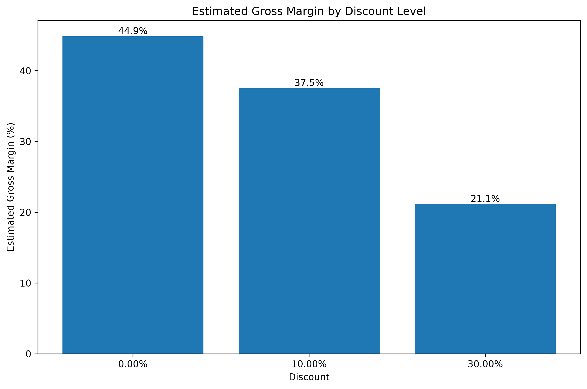

# European Fashion Retail Analysis — SQL

## Overview

This project analyzes transactional data from a European fashion retailer using PostgreSQL.

The analysis focuses on sales performance, product profitability, customer behavior, customer segmentation, and discount economics. A major emphasis of the project is data validation: field meanings, relationships, and calculation logic were tested before business KPIs were calculated.

The dataset contains 905 sales transactions, 2,253 sales line items, 1,000 customers, 500 products, and 7 marketing campaigns.

## Business Questions

The analysis was designed to answer:

- How much revenue and estimated gross profit did the retailer generate?
- Which countries and sales channels performed best?
- Which product categories and individual products generated the most revenue and profit?
- How do purchasing patterns differ across customers and countries?
- Which customers are high-value, loyal, recent, or at risk?
- How are discounts associated with gross margin and purchase quantities?
- Can individual marketing campaigns be reliably attributed to transactions?

## Tools & Techniques

**PostgreSQL**
- Joins
- CTEs
- Window functions
- `LAG()`
- `RANK()`
- `NTILE()`
- Conditional aggregation
- `CASE` expressions
- Date calculations
- RFM segmentation
- Data-quality validation

**Python**
- pandas
- matplotlib

Python was used only to visualize the final SQL outputs. Core data preparation, validation, KPI calculation, and business analysis were performed in PostgreSQL.

## Dataset Structure

The analysis uses seven relational tables:

- `customers`
- `products`
- `sales`
- `salesitems`
- `channels`
- `campaigns`
- `stock`

The primary analytical relationship is:

customers → sales → salesitems → products

## Data Validation

Before performing the analysis, the dataset was tested for:

- Null primary identifiers
- Orphaned customer, sale, and product relationships
- Sales channel consistency
- Transaction-date consistency
- Order-total reconciliation
- Line-item calculations
- Discount calculation logic
- Campaign attribution reliability

No orphaned customer, sale, or product relationships were found.

Order totals successfully reconciled between the sales and sales-item tables.

Several important semantic issues were discovered during validation. In particular, `discounted_item_total` behaves as a binary discount indicator rather than a monetary total.

The `salesitems` transaction dates also contained inconsistencies relative to the authoritative sales-level dates, so `sales.sale_date` was used for time-based analysis. 

## Executive KPIs

| KPI | Result |
|---|---:|
| Revenue | €324,236.66 |
| Orders | 905 |
| Units Sold | 6,715 |
| Average Order Value | €358.27 |
| Purchasing Customers | 580 |
| Estimated Gross Profit | €141,153.29 |
| Estimated Gross Margin | 43.53% |

## Geographic Performance

Germany generated the highest total revenue at **€74,590.69**, followed by France at **€72,300.66**.

Portugal had the highest revenue per purchasing customer at **€623.56**, despite having the smallest purchasing-customer base.



## Product Profitability

Shoes generated the highest category revenue at **€70,074**, while T-Shirts generated the highest estimated gross profit at **€30,782.64**.

Pants produced the highest estimated profit per unit at **€22.62**.



The highest-revenue individual product was **Relaxed Ribbed Trousers**, generating **€2,379.30** in revenue and approximately **€1,130.10** in gross profit.



## Customer Segmentation

RFM analysis was used to segment purchasing customers according to:

- **Recency** — days since the customer's most recent purchase
- **Frequency** — number of orders placed
- **Monetary value** — lifetime revenue during the dataset period

The dataset's maximum transaction date was used as the recency reference date rather than the current date.

| Segment | Customers | Avg. Revenue / Customer | Revenue Share |
|---|---:|---:|---:|
| Loyal Customers | 117 | €730.46 | 26.36% |
| High Value - Inactive | 89 | €672.17 | 18.45% |
| Champions | 45 | €1,247.27 | 17.31% |
| Low Engagement | 184 | €299.80 | 17.01% |
| Recent Customers | 128 | €364.85 | 14.40% |
| At Risk | 17 | €1,232.87 | 6.46% |



A particularly important retention opportunity was identified among the **17 At Risk customers**. Although small in number, these customers generated **€20,958.77** in historical revenue and averaged **3.47 orders** and **€1,232.87 per customer**.

## Discount Analysis

Discount depth was strongly associated with lower estimated gross margins.

| Discount | Gross Margin | Avg. Units / Line |
|---|---:|---:|
| 0% | 44.87% | 2.99 |
| 10% | 37.54% | 2.87 |
| 30% | 21.15% | 2.84 |



Thirty-percent discounted items had an estimated gross margin of only **21.15%**, compared with **44.87%** for non-discounted items.

Average units per line did not increase with discount depth in the observed data. Because this is observational data, these results demonstrate association rather than proving that discounts caused changes in purchasing behavior.

## Key Business Insights

1. **Discount depth deserves review.**  
   The 30% discount group retained less than half the gross-margin percentage of non-discounted items without showing higher average units per line.

2. **High-value inactive customers represent a retention opportunity.**  
   The RFM analysis identified 17 At Risk customers with high historical spending and purchase frequency.

3. **Country size and customer value tell different stories.**  
   Germany generated the highest overall revenue, while Portugal generated the highest revenue per purchasing customer.

4. **Category performance depends on the KPI used.**  
   Shoes led revenue, T-Shirts led estimated gross profit, and Pants led estimated profit per unit.

5. **E-commerce narrowly outperformed mobile.**  
   E-commerce accounted for 52.95% of revenue compared with 47.05% for App Mobile.

## Campaign Attribution Limitation

Named campaign ROI was intentionally not calculated.

The campaigns table does not provide a reliable transaction-level campaign identifier. Testing campaign dates, marketing channels, and discount values revealed inconsistencies between campaign definitions and transaction-level records.

As a result, attributing transaction revenue to individual named campaigns would require assumptions not supported by the data.

The analysis therefore reports directly observed marketing-channel and discount performance rather than unsupported campaign ROI.

## Limitations

- The transaction period runs from April 4 through June 17, 2025, providing a relatively short customer-history window.
- June is a partial month and should not be directly compared with complete April and May periods.
- Estimated gross profit uses product cost price and does not include fulfillment, shipping, payment processing, returns, taxes, or other operating expenses.
- RFM segmentation therefore represents short-window behavioral segmentation rather than long-term customer lifecycle behavior.
- Discount results are observational and should not be interpreted as causal effects.
- Reliable transaction-level attribution to named marketing campaigns is unavailable.

## Repository Structure

```text
├── sql/
│   ├── 01_database_setup.sql
│   ├── 02_data_quality.sql
│   ├── 03_sales_analysis.sql
│   ├── 04_product_analysis.sql
│   ├── 05_customer_analysis.sql
│   ├── 06_campaign_analysis.sql
│   └── 07_executive_summary.sql
│
├── outputs/
│   ├── tables/
│   └── figures/
│
├── visualizations/
│   └── create_visualizations.py
│
└── README.md